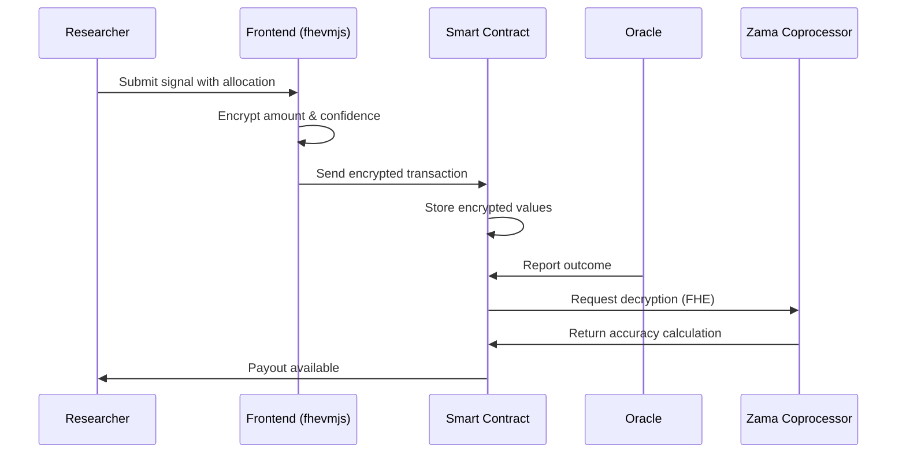

# Privora

<div align="center">


**Confidential Prediction Markets Powered by Fully Homomorphic Encryption**

[](https://opensource.org/licenses/MIT)
[](https://docs.zama.ai/fhevm)
[](https://reactjs.org/)
[](https://soliditylang.org/)
[](https://nodejs.org/)
[](https://www.mongodb.com/)

</div>

---

## 🌟 Overview

Privora is a **privacy-first intelligence infrastructure** leveraging **Fully Homomorphic Encryption (FHE)** to enable confidential market analysis while maintaining verifiable outcomes. Built on Zama's FHEVM technology, Privora provides institutional-grade encrypted intelligence gathering for strategic decision-making without exposing proprietary insights.

> **Why Privora?** Traditional prediction markets expose your positions, strategies, and conviction levels. Privora encrypts everything—your research allocations, confidence scores, and accuracy metrics remain private while still enabling verifiable, trustless settlement.

---

## ✨ Key Features

### 🔐 Privacy-First Architecture
- **Encrypted Signal Generation**: Research positions remain confidential until publication
- **Zero-Knowledge Analysis**: No participant can view others' research allocations or confidence levels
- **Homomorphic Aggregation**: Mathematical operations on encrypted data without decryption
- **Verifiable Settlement**: Smart contract-powered resolution with oracle verification

### 🎯 Institutional-Grade Infrastructure
- **Multi-Signature Governance**: Decentralized administration with role-based permissions
- **Real-Time Analytics**: Encrypted performance tracking and reputation scoring
- **Cross-Chain Compatibility**: Deployable on any EVM-compatible network
- **Institutional Wallet Integration**: Support for multisig and custody solutions

### 🏗️ Developer-Friendly
- **Modular Smart Contracts**: Upgradeable and extensible architecture
- **TypeScript Support**: Full type safety across the stack
- **Comprehensive Documentation**: Technical guides and API references
- **Testing Suite**: Unit and integration tests for all components

---

## 🎯 Use Cases

| Sector | Application | Benefits |
|--------|-------------|----------|
| **Hedge Funds** | Confidential position sizing and conviction tracking | Hide trading strategies from competitors |
| **Market Research** | Private hypothesis testing without revealing methodology | Protect proprietary research models |
| **Risk Management** | Encrypted scenario analysis and portfolio stress testing | Secure sensitive risk assessments |
| **Strategic Planning** | Confidential forecasting without exposing direction | Maintain competitive advantage |

---

## 📊 Live Contracts (Sepolia)

All contracts are deployed and verified on Sepolia Etherscan:

| Contract | Address | Description | Etherscan |
|----------|---------|-------------|-----------|
| **PredictionHub** | `0x9C79418985E55C9feC2dCAf5358aD41dAd49B813` | Core signal management | [View](https://sepolia.etherscan.io/address/0x9C79418985E55C9feC2dCAf5358aD41dAd49B813) |
| **SettlementEngine** | `0xfAD4889Bf30A4C28A100B990eAEaa4D096b6Cbe9` | Accuracy resolution & payouts | [View](https://sepolia.etherscan.io/address/0xfAD4889Bf30A4C28A100B990eAEaa4D096b6Cbe9) |
| **IntelligenceLedger** | `0x1774204aC423F469Ef25EAB16b551d7b4fe5C831` | Analytics & reputation tracking | [View](https://sepolia.etherscan.io/address/0x1774204aC423F469Ef25EAB16b551d7b4fe5C831) |
| **GovernanceController** | `0x780a5a98d59f6F2C2FfF2a02dab93B0f1d0C522A` | Administrative controls | [View](https://sepolia.etherscan.io/address/0x780a5a98d59f6F2C2FfF2a02dab93B0f1d0C522A) |
| **TopicRegistry** | `0xb623B10708239e148E77451BD18410332055B33a` | Category management | [View](https://sepolia.etherscan.io/address/0xb623B10708239e148E77451BD18410332055B33a) |
| **USDC (Sepolia)** | `0x18C97d762dF7Ee8Efa413B99bf2D14943E420Fc2` | Payment token | [View](https://sepolia.etherscan.io/address/0x18C97d762dF7Ee8Efa413B99bf2D14943E420Fc2) |

---

## 🏗️ Project Structure

```
privora/
├── 📱 frontend/          # React-based intelligence terminal
│   ├── src/
│   │   ├── components/   # Reusable UI components
│   │   ├── pages/        # Application pages
│   │   ├── services/     # API and blockchain services
│   │   └── utils/        # Utility functions
│   └── package.json
│
├── ⚙️ backend/           # Node.js API for data orchestration
│   ├── src/
│   │   ├── controllers/ # Route controllers
│   │   ├── models/       # MongoDB models
│   │   ├── routes/       # API routes
│   │   └── services/     # Business logic
│   └── package.json
│
├── 📜 protocol/          # Solidity smart contracts
│   ├── contracts/
│   │   ├── PredictionHub.sol      # Signal management
│   │   ├── SettlementEngine.sol   # Resolution & payouts
│   │   ├── IntelligenceLedger.sol # Analytics
│   │   └── GovernanceController.sol # Admin controls
│   └── package.json
│
├── 📚 docs/              # Technical documentation
│   ├── INDEX.md            # Documentation index
│   ├── GETTING_STARTED.md  # Installation guide
│   ├── USER_GUIDE.md       # End-user documentation
│   ├── ADMIN_GUIDE.md      # Administrative operations
│   ├── TECHNICAL_ARCHITECTURE.md
│   ├── FHEVM_INTEGRATION.md
│   ├── API_REFERENCE.md    # REST API documentation
│   ├── SMART_CONTRACTS.md  # Contract documentation
│   ├── ENTERPRISE_GUIDE.md # Enterprise deployment
│   ├── INTELLIGENCE_FRAMEWORK.md # Signal framework
│   └── TROUBLESHOOTING.md  # Common issues
│
└── package.json          # Monorepo configuration
```

---

## 🚀 Quick Start

### Prerequisites
- **Node.js** 18+ (recommended: 20.x LTS)
- **npm** 9+ or **yarn** 1.22+
- **MongoDB** 6+ (local or Atlas)
- **Git** 2.30+

### Installation

```bash
# Clone the repository
git clone https://github.com/charan0318/privora.git
cd privora

# Install all dependencies (monorepo)
npm run install:all

# Set up environment variables
cp .env.example .env
# Edit .env with your configuration
```

### Development

```bash
# Start all services (frontend + backend)
npm run dev

# Or start individually:
npm run dev:backend   # Backend API on port 5002
npm run dev:frontend  # Frontend on port 5173
```

### Smart Contracts

```bash
cd protocol

# Compile contracts
npm run compile

# Start local Hardhat node
npm run node

# Deploy to local network
npm run deploy:local

# Deploy to Sepolia
npm run deploy:sepolia
```

---

## 🔐 How It Works: Encrypted Intelligence Flow



### Step-by-Step Process

1. **Signal Submission**: Researcher inputs signal parameters
2. **Client-Side Encryption**: `fhevmjs` encrypts confidence and allocation
3. **On-Chain Storage**: Encrypted values stored in `PredictionHub`
4. **Oracle Resolution**: Outcome reported and decryption requested
5. **Accuracy Calculation**: Zama coprocessor computes accuracy homomorphically
6. **Payout Distribution**: Researchers claim verified rewards

---

## 🛠️ Tech Stack

| Layer | Technology | Version |
|-------|------------|---------|
| **Smart Contracts** | Solidity | 0.8.27 |
| **Development** | Hardhat | 2.26+ |
| **Frontend** | React | 18.x |
| **Build Tool** | Vite | 4.x |
| **Styling** | TailwindCSS | 3.x |
| **Backend** | Node.js | 18.x |
| **Framework** | Express | 4.x |
| **Database** | MongoDB | 6.x |
| **Encryption** | Zama FHEVM | 0.8+ |
| **Blockchain** | Ethereum/EVM | Sepolia |


---

## 🤝 Contributing

We welcome contributions! Please see our contributing guidelines:

1. Fork the repository
2. Create your feature branch (`git checkout -b feature/amazing-feature`)
3. Commit your changes (`git commit -m 'Add amazing feature'`)
4. Push to the branch (`git push origin feature/amazing-feature`)
5. Open a Pull Request

### Development Guidelines

- Follow existing code style and conventions
- Add tests for new functionality
- Update documentation as needed
- Ensure all CI checks pass

---

## 🆘 Support

- **Documentation**: [docs/](docs/)
- **Issues**: [GitHub Issues](https://github.com/charan0318/privora/issues)
- **Discussions**: [GitHub Discussions](https://github.com/charan0318/privora/discussions)

---

## 📄 License

MIT License - see [LICENSE](LICENSE) for details.

---

<div align="center">

**Built with ❤️ by the Ch04n**

[](https://zama.ai)

</div>