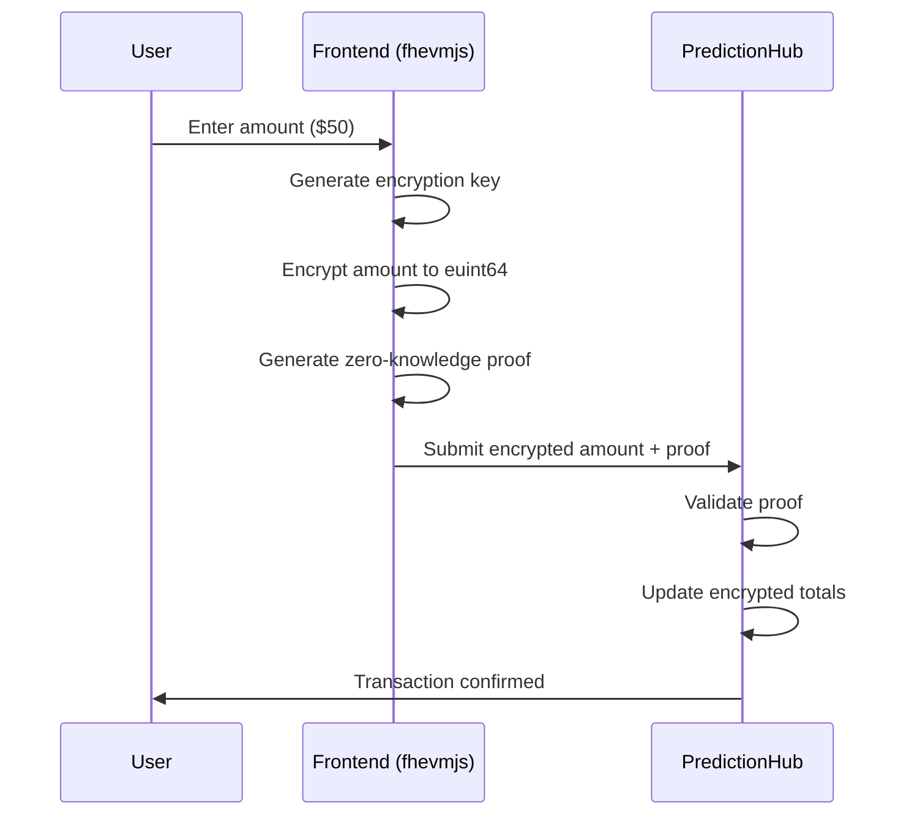
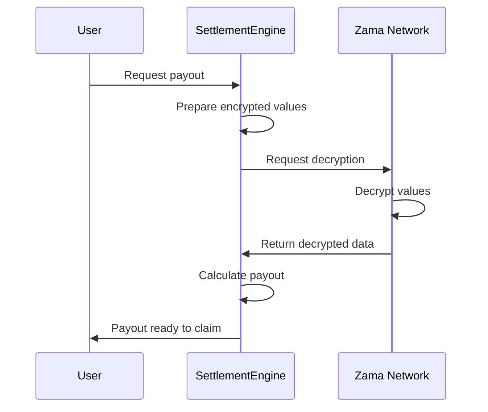

# Zama FHEVM Integration Documentation

Complete technical guide on how Fully Homomorphic Encryption is integrated into the Privora platform.

---

## 📋 Table of Contents

1. [Overview](#-overview)
2. [Architecture](#-architecture)
3. [FHEVM Features Used](#-fhevm-features-used)
4. [Contract-by-Contract Breakdown](#-contract-by-contract-breakdown)
5. [Frontend Integration Flow](#-frontend-integration-flow)
6. [Complete User Journeys](#-complete-user-journeys)
7. [Encryption Flow Diagrams](#-encryption-flow-diagrams)

---

## 🌟 Overview

This prediction market platform leverages **Zama's FHEVM (Fully Homomorphic Encryption Virtual Machine)** to provide **complete privacy** for user bet amounts, positions, and balances while maintaining a **fair, transparent payout system**.

**Core Privacy Features:**
- ✅ **Private Bet Amounts**: Users' bet amounts are encrypted and never revealed publicly
- ✅ **Private Positions**: Which option a user chose remains encrypted until resolution
- ✅ **Private Balances**: User wallet balances within the contract are encrypted
- ✅ **Private Pool Totals**: Total amounts per option are encrypted during betting
- ✅ **Fair Payouts**: Decryption only occurs after bet resolution for fair distribution

---

## 🏗️ Architecture

```
┌─────────────────────────────────────────────────────────────┐
│                     FRONTEND (React)                        │
│  ┌──────────────────────────────────────────────────────┐   │
│  │  fhevmjs: Client-side encryption library           │   │
│  │  - Generate encryption keys                        │   │
│  │  - Encrypt user inputs (amount, option, outcome)     │   │
│  │  - Create zero-knowledge proofs                    │   │
│  └──────────────────────────────────────────────────────┘   │
└─────────────────────────────────────────────────────────────┘
                            ↓ Encrypted Data + Proofs
┌─────────────────────────────────────────────────────────────┐
│              SMART CONTRACTS (Solidity + FHEVM)             │
│  ┌────────────────┐  ┌────────────────┐  ┌──────────────┐   │
│  │ PredictionHub  │  │SettlementEngine │  │IntelligenceLedger│   │
│  │ - Encrypted    │  │ - Async        │  │ - Statistics │   │
│  │   operations   │  │   decryption   │  │   decryption │   │
│  │ - FHE compute  │  │ - Payouts      │  │ - Analytics  │   │
│  └────────────────┘  └────────────────┘  └──────────────┘   │
└─────────────────────────────────────────────────────────────┘
                            ↓ Decryption Requests
┌─────────────────────────────────────────────────────────────┐
│            ZAMA INFRASTRUCTURE                              │
│  ┌──────────────────────────────────────────────────────┐   │
│  │  Gateway: Handles encrypted inputs                   │   │
│  │  KMS (Key Management): Manages encryption keys       │   │
│  │  Coprocessor: Performs FHE computations              │   │
│  │  Relayer: Returns decrypted results via callbacks    │   │
│  └──────────────────────────────────────────────────────┘   │
└─────────────────────────────────────────────────────────────┘
```

---

## 🔐 FHEVM Features Used

### Encrypted Data Types

Our platform extensively uses Zama's encrypted integer types:

| Type      | Usage                                              | Location           |
|-----------|----------------------------------------------------|--------------------|
| `euint64` | User balances, bet amounts, pool totals, volumes   | PredictionHub.sol  |
| `euint32` | Participant counts                                 | PredictionHub.sol  |
| `euint8`  | Option indices, outcome selections                   | PredictionHub.sol  |
| `ebool`   | Validation results, conditional logic              | PredictionHub.sol  |

### Core FHEVM Operations

#### 1. Encryption Operations

```solidity
// Convert plaintext to encrypted
euint64 encrypted = FHE.asEuint64(plainValue);

// Import encrypted data from user with proof verification
euint64 amount = FHE.fromExternal(_encryptedAmount, _amountProof);
```

#### 2. Encrypted Arithmetic

```solidity
// Addition
totalPool = FHE.add(currentPool, newAmount);

// Subtraction
newBalance = FHE.sub(currentBalance, betAmount);

// Conditional selection (encrypted ternary operator)
result = FHE.select(condition, ifTrue, ifFalse);
```

#### 3. Encrypted Comparisons

```solidity
// Greater than or equal
ebool isValid = FHE.ge(balance, amount);

// Less than
ebool withinLimit = FHE.lt(optionIndex, maxOptions);

// Equality check
ebool isMatch = FHE.eq(userChoice, winningOption);

// Logical AND
ebool allValid = FHE.and(condition1, condition2);
```

#### 4. Permission Management

```solidity
// Allow contract to access encrypted value
FHE.allowThis(encryptedValue);

// Allow specific address to decrypt
FHE.allow(encryptedValue, userAddress);

// Mark value for public decryption (via async callback)
FHE.makePubliclyDecryptable(encryptedValue);
```

#### 5. Asynchronous Decryption

```solidity
// Prepare encrypted values for decryption
bytes32[] memory cts = new bytes32[](count);
cts[0] = FHE.toBytes32(encryptedValue1);
cts[1] = FHE.toBytes32(encryptedValue2);

// Request decryption with callback
uint256 requestId = FHE.requestDecryption(cts, this.callbackFunction.selector);

// Verify and process decryption results
function callbackFunction(
    uint256 requestId,
    bytes memory cleartexts,
    bytes memory decryptionProof
) external {
    FHE.checkSignatures(requestId, cleartexts, decryptionProof);
    // Process decrypted values
}
```

---

## 📜 Contract-by-Contract Breakdown

### 1. PredictionHub.sol - Encrypted Betting Logic

**Purpose**: Handles all encrypted prediction operations with full privacy

#### FHEVM Features Implementation

##### A. Encrypted User Balances

**Location**: `deposit()`, `withdraw()`, `_processEncryptedBet()`, `_processNestedEncryptedBet()`

```solidity
// Line 158: Encrypt deposit amount
euint64 amountEncrypted = FHE.asEuint64(uint64(_amount));

// Line 162-163: Add to encrypted balance
if (FHE.isInitialized(currentBalance)) {
    userEncryptedBalances[msg.sender] = FHE.add(currentBalance, amountEncrypted);
} else {
    userEncryptedBalances[msg.sender] = amountEncrypted;
}

// Line 167-168: Grant permissions
FHE.allowThis(userEncryptedBalances[msg.sender]);
FHE.allow(userEncryptedBalances[msg.sender], msg.sender);
```

**Frontend Trigger**:
- **File**: `frontend/src/components/betting/DepositWithdrawModal.jsx`
- **Function**: `handleDeposit()` at line 45
- **User Action**: Click "Deposit" button → Enter USDC amount → Approve → Deposit
- **Flow**: USDC transferred → Contract encrypts amount → Adds to user's encrypted balance

##### B. Encrypted Prediction Placement (Binary/Multiple Choice)

**Location**: `submitPosition()`, `_processEncryptedPosition()`

```solidity
// Lines 272-273: Import encrypted inputs with proof verification
euint8 optionIndex = FHE.fromExternal(_encryptedOptionIndex, _optionProof);
euint64 amount = FHE.fromExternal(_encryptedAmount, _amountProof);

// Lines 339-344: Encrypted validation using ebool
ebool validOption = FHE.lt(optionIndex, FHE.asEuint8(uint8(predictions[_predictionId].optionCount)));
ebool validMinAmount = FHE.ge(amount, FHE.asEuint64(uint64(predictions[_predictionId].minPositionAmount)));
ebool validMaxAmount = FHE.le(amount, FHE.asEuint64(uint64(predictions[_predictionId].maxPositionAmount)));
ebool validAmount = FHE.and(validMinAmount, validMaxAmount);
ebool hasSufficientBalance = FHE.ge(currentBalance, amount);
ebool allValid = FHE.and(FHE.and(validOption, validAmount), hasSufficientBalance);

// Line 346: Conditional balance update (encrypted ternary)
euint64 updatedBalance = FHE.select(allValid, FHE.sub(currentBalance, amount), currentBalance);

// Lines 353-356: Store encrypted user choice
if (isFirstPosition) {
    userOptionChoices[msg.sender][_predictionId] = FHE.select(allValid, optionIndex, FHE.asEuint8(0));
} else {
    euint8 existingChoice = userOptionChoices[msg.sender][_predictionId];
    userOptionChoices[msg.sender][_predictionId] = FHE.select(allValid, optionIndex, existingChoice);
}

// Lines 358-362: Permission management
FHE.allowThis(userOptionChoices[msg.sender][_predictionId]);
FHE.allow(userOptionChoices[msg.sender][_predictionId], msg.sender);
if (settlementContract != address(0)) {
    FHE.allow(userOptionChoices[msg.sender][_predictionId], settlementContract);
}
```

**Frontend Trigger**:
- **File**: `frontend/src/modules/prediction/PredictionPlacementModal.jsx`
- **Function**: `handleSubmitPosition()` at line 120
- **User Action**: Select option → Enter amount → Click "Submit Position"
- **Flow**:
  1. User selects "Option A" and enters "$50"
  2. fhevmjs encrypts optionIndex (0) and amount (50)
  3. Generates zero-knowledge proofs
  4. Contract receives encrypted data + proofs
  5. Performs encrypted validations
  6. Updates encrypted balances and totals
  7. **NO ONE CAN SEE**: Which option user chose or how much they positioned

##### C. Encrypted Prediction Placement (Nested Markets)

**Location**: `submitNestedPosition()`, `_processNestedEncryptedPosition()`

```solidity
// Lines 309-311: Import 3 encrypted inputs (option, outcome, amount)
euint8 optionIndex = FHE.fromExternal(_encryptedOptionIndex, _optionProof);
euint8 outcome = FHE.fromExternal(_encryptedOutcome, _outcomeProof);
euint64 amount = FHE.fromExternal(_encryptedAmount, _amountProof);

// Lines 382-388: Extended encrypted validation
ebool validOption = FHE.lt(optionIndex, FHE.asEuint8(uint8(predictions[_predictionId].optionCount)));
ebool validOutcome = FHE.lt(outcome, FHE.asEuint8(2)); // YES=0, NO=1
ebool validMinAmount = FHE.ge(amount, FHE.asEuint64(uint64(predictions[_predictionId].minPositionAmount)));
ebool validMaxAmount = FHE.le(amount, FHE.asEuint64(uint64(predictions[_predictionId].maxPositionAmount)));
ebool validAmount = FHE.and(validMinAmount, validMaxAmount);
ebool hasSufficientBalance = FHE.ge(currentBalance, amount);
ebool allValid = FHE.and(FHE.and(FHE.and(validOption, validOutcome), validAmount), hasSufficientBalance);

// Lines 468-491: Nested encrypted updates with double-loop
for (uint256 i = 0; i < len; i++) {
    euint8 currentOption = FHE.asEuint8(uint8(i));
    ebool isThisOption = FHE.eq(optionIndex, currentOption);

    for (uint8 j = 0; j < 2; j++) {
        euint8 currentOutcome = FHE.asEuint8(j);
        ebool isThisOutcome = FHE.eq(outcome, currentOutcome);
        ebool shouldUpdate = FHE.and(FHE.and(isValid, isThisOption), isThisOutcome);

        // Update encrypted amounts conditionally
        euint64 currentUserAmount = userNestedPositionAmounts[msg.sender][_predictionId][i][j];
        userNestedPositionAmounts[msg.sender][_predictionId][i][j] = FHE.select(
            shouldUpdate,
            FHE.add(currentUserAmount, amount),
            currentUserAmount
        );
    }
}
```

**Frontend Trigger**:
- **File**: `frontend/src/modules/prediction/PredictionPlacementModal.jsx`
- **Function**: `handleSubmitNestedPosition()` at line 200
- **User Action**: Select option → Select YES/NO → Enter amount → Submit Position
- **Flow**:
  1. User selects "Will Trump Win?" → "YES" → "$100"
  2. fhevmjs encrypts option (0), outcome (0=YES), amount (100)
  3. Three proofs generated
  4. Contract validates all encrypted inputs
  5. Updates nested encrypted totals
  6. **Privacy**: Option, outcome, and amount all remain encrypted

##### D. Encrypted Pool Totals

**Location**: `_updateEncryptedTotals()`, `_updateNestedEncryptedTotals()`

```solidity
// Lines 411-433: Update encrypted per-option totals
for (uint256 i = 0; i < len; i++) {
    euint8 currentOption = FHE.asEuint8(uint8(i));
    ebool isThisOption = FHE.eq(optionIndex, currentOption);
    ebool shouldUpdate = FHE.and(isValid, isThisOption);

    // Update user's position amount for this option
    euint64 currentUserAmount = isFirstPosition ? FHE.asEuint64(0) : userPositionAmounts[msg.sender][_predictionId][i];
    userPositionAmounts[msg.sender][_predictionId][i] = FHE.select(
        shouldUpdate,
        FHE.add(currentUserAmount, amount),
        currentUserAmount
    );

    // Update total pool for this option
    euint64 currentTotal = positionTotals[_predictionId][i];
    positionTotals[_predictionId][i] = FHE.select(
        shouldUpdate,
        FHE.add(currentTotal, amount),
        currentTotal
    );

    // Make decryptable for stats
    FHE.makePubliclyDecryptable(positionTotals[_predictionId][i]);
}

// Lines 435-441: Update encrypted total pool
euint64 currentPool = totalPoolAmounts[_predictionId];
totalPoolAmounts[_predictionId] = FHE.select(isValid, FHE.add(currentPool, amount), currentPool);
FHE.makePubliclyDecryptable(totalPoolAmounts[_predictionId]);

// Lines 443-446: Update global volume (encrypted across ALL predictions)
globalTotalVolume = FHE.select(isValid, FHE.add(globalTotalVolume, amount), globalTotalVolume);
FHE.makePubliclyDecryptable(globalTotalVolume);
```

**Frontend Display**:
- **File**: `frontend/src/views/Admin.jsx`
- **Function**: `loadAdminData()` at line 44
- **Display**: Admin dashboard stats cards
- **Decryption**:
  1. Admin dashboard calls `getFhevmInstance()`
  2. Requests decryption of `globalTotalVolume`
  3. Displays total platform volume in USDC
  4. **Note**: Individual position amounts remain private

##### E. Encrypted Participant Counting

**Location**: `_processEncryptedPosition()`, `_processNestedEncryptedPosition()`

```solidity
// Lines 372-375: Increment participant count (encrypted)
if (isFirstPosition) {
    euint32 currentParticipants = totalParticipants[_predictionId];
    totalParticipants[_predictionId] = FHE.select(
        allValid,
        FHE.add(currentParticipants, FHE.asEuint32(1)),
        currentParticipants
    );
    FHE.makePubliclyDecryptable(totalParticipants[_predictionId]);
}
```

**Frontend Display**:
- **File**: `frontend/src/modules/prediction/PredictionDetail.jsx`
- **Function**: `fetchPredictionData()` at line 88
- **Display**: Shows "X participants" under prediction details
- **Privacy**: Count is public, but WHO participated remains private

---

### 2. SettlementEngine.sol - Encrypted Payout Calculation

**Purpose**: Calculates fair payouts using encrypted data via async decryption

#### FHEVM Features Implementation

##### A. Requesting Payout Decryption

**Location**: `requestPayout()`

```solidity
// Lines 43-73: Prepare encrypted values for decryption
bytes32[] memory cts;

if (predictionType == PredictionHub.PredictionType.BINARY || predictionType == PredictionHub.PredictionType.MULTIPLE_CHOICE) {
    cts = new bytes32[](optionCount * 2 + 1);
    uint256 idx = 0;

    // Convert user's encrypted bet amounts to bytes32
    for (uint256 i = 0; i < optionCount; i++) {
        cts[idx++] = FHE.toBytes32(core.getUserEncryptedBetAmount(msg.sender, _betId, i));
    }

    // Add total pool
    cts[idx++] = FHE.toBytes32(core.getTotalPoolEncrypted(_betId));

    // Add option totals
    for (uint256 i = 0; i < optionCount; i++) {
        cts[idx++] = FHE.toBytes32(core.getOptionEncryptedTotal(_betId, i));
    }
} else { // NESTED
    // Similar but with YES/NO outcomes
    for (uint256 i = 0; i < optionCount; i++) {
        cts[idx++] = FHE.toBytes32(core.getUserNestedBetAmount(msg.sender, _betId, i, 0)); // YES
        cts[idx++] = FHE.toBytes32(core.getUserNestedBetAmount(msg.sender, _betId, i, 1)); // NO
    }
}

// Line 75: Submit decryption request to Zama network
uint256 requestId = FHE.requestDecryption(cts, this.callbackPayout.selector);
```

**Frontend Trigger**:
- **File**: `frontend/src/components/betting/PayoutSection.jsx`
- **Function**: `handleRequestPayout()` at line 95
- **User Action**: Bet is resolved → User clicks "Request Payout"
- **Flow**:
  1. User clicks "Request Payout" on won bet
  2. Transaction sent to SettlementEngine
  3. Contract prepares encrypted values for decryption
  4. Zama network processes decryption request
  5. Callback function receives decrypted values

##### B. Payout Calculation Callback

**Location**: `callbackPayout()`

```solidity
function callbackPayout(
    uint256 requestId,
    bytes32[] calldata cts,
    bytes calldata cleartexts,
    bytes calldata decryptionProof
) external {
    // Verify the decryption came from Zama
    FHE.checkSignatures(requestId, cleartexts, decryptionProof);
    
    // Parse decrypted values
    uint64 userAmount = abi.decode(cleartexts[:32], (uint64));
    uint64 totalPool = abi.decode(cleartexts[32:64], (uint64));
    uint64[] memory optionTotals = new uint64[](optionCount);
    
    // Calculate payout using parimutuel formula
    uint64 winningPool = optionTotals[winningOptionIndex];
    uint64 distributablePool = totalPool - liquidity;
    uint64 payout = (userAmount * distributablePool) / winningPool;
    
    // Store payout for claiming
    pendingPayouts[msg.sender][betId] = payout;
}
```

---

## 🖥️ Frontend Integration Flow

### FHEVM Initialization

**File**: `frontend/src/lib/fhe.js`

```javascript
// 1. Initialize FHEVM instance
const instance = await initializeFHE();

// 2. Create FHE client
const { publicKey, privateKey } = instance.generateKeypair();

// 3. Generate EIP-712 signature (proves you own the wallet)
const signature = await provider.send('eth_signTypedData_v4', [account, eip712]);

// 4. Store instance for encryption/decryption
setFhevmInstance(instance);

// 5. Ready to place encrypted bets! ✅
```

### Encryption Process

**File**: `frontend/src/lib/fhe.js`

```javascript
// 1. Encrypt bet amount using FHEVM
const encryptedAmount = await fhevmInstance.encrypt64(amountInMicroUSDC);

// 2. Create encrypted input for smart contract
const encryptedInput = fhevmInstance.createEncryptedInput(contractAddress, account);
encryptedInput.add64(amountInMicroUSDC);
const encryptedData = encryptedInput.encrypt();

// 3. Submit encrypted bet to blockchain
const tx = await contract.placeBet(
  betId,
  optionIndex,
  encryptedData.handles[0],
  encryptedData.inputProof
);

// 4. Your bet amount remains encrypted on-chain ✅
// Only you can decrypt it (or admin via relayer for resolution)
```

---

## 🔄 Complete User Journeys

### Journey 1: Placing a Private Bet

```
User → Select Option → Enter Amount → fhevmjs Encrypts → Submit Transaction
  ↓
Contract → Validate Encrypted Inputs → Update Encrypted Totals → Emit Event
  ↓
User → See Success → Position Cached Locally
```

### Journey 2: Requesting and Claiming Payout

```
User → Click "Request Payout" → Transaction Sent
  ↓
Contract → Prepare Decryption Request → Zama Network
  ↓
Zama → Decrypt Values → Callback to Contract
  ↓
Contract → Calculate Payout → Store for Claiming
  ↓
User → Click "Claim" → Receive USDC
```

---

## 📊 Encryption Flow Diagrams

### Bet Placement Encryption Flow



### Payout Decryption Flow



---

## 📚 Summary

The FHEVM integration provides:

- **Complete Privacy**: All sensitive data encrypted on-chain
- **Verifiable Operations**: Zero-knowledge proofs ensure validity
- **Fair Payouts**: Decryption only after resolution
- **User-Friendly**: Transparent UX with hidden complexity

For more information, see:
- **Technical Architecture:** [TECHNICAL_ARCHITECTURE.md](TECHNICAL_ARCHITECTURE.md)
- **Smart Contracts:** `protocol/contracts/`
- **Zama FHEVM Docs:** [docs.zama.ai/fhevm](https://docs.zama.ai/fhevm)