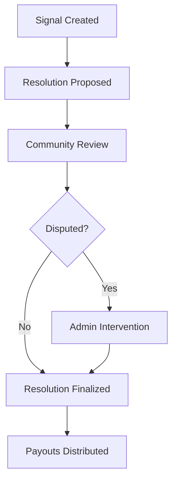
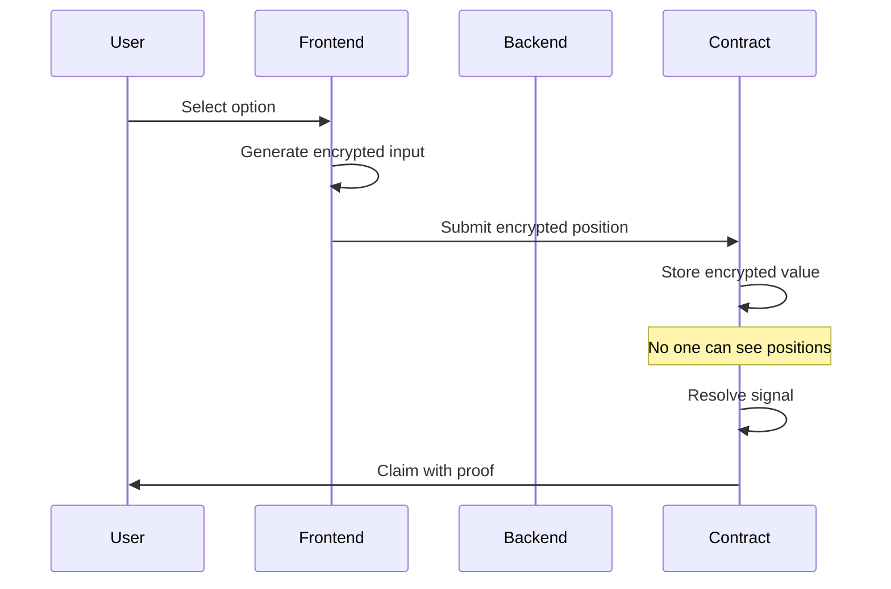

# Intelligence Framework

Research signal generation, validation, and intelligence marketplace framework.

---

## 📋 Table of Contents

1. [Overview](#-overview)
2. [Signal Types](#-signal-types)
3. [Validation Framework](#-validation-framework)
4. [Scoring System](#-scoring-system)
5. [Market Mechanisms](#-market-mechanisms)
6. [Privacy Model](#-privacy-model)

---

## 🌟 Overview

The Privora Intelligence Framework enables:
- **Signal Creation**: Researchers submit encrypted predictions
- **Market Discovery**: Users find signals through categories
- **Position Trading**: Stake on prediction outcomes
- **Privacy-First**: FHE encryption protects positions
- **Payout Distribution**: Automated winner rewards

---

## 📊 Signal Types

### Binary Signals (Type 0)

Two-outcome predictions with clear resolution.

```solidity
// Example: "Will BTC reach $100k by EOY?"
options: ["Yes", "No"]
predictionType: 0
```

**Use Cases:**
- Price targets
- Event occurrence
- Binary outcomes

### Multiple Choice (Type 1)

Multiple discrete outcomes.

```solidity
// Example: "Which team wins the championship?"
options: ["Team A", "Team B", "Team C", "Team D"]
predictionType: 1
```

**Use Cases:**
- Election predictions
- Tournament brackets
- Category winners

### Nested Signals (Type 2)

Multi-dimensional predictions with conditional outcomes.

```solidity
// Example: "BTC price at EOY"
options: ["<$50k", "$50k-$100k", ">$100k"]
predictionType: 2
```

**Use Cases:**
- Price ranges
- Multi-tier outcomes
- Conditional predictions

---

## ✅ Validation Framework

### Signal Quality Criteria

| Criterion | Weight | Description |
|-----------|--------|-------------|
| Clarity | 25% | Clear, unambiguous outcome |
| Verifiability | 25% | Publicly verifiable resolution |
| Timeliness | 20% | Reasonable time horizon |
| Specificity | 15% | Precise outcome definition |
| Relevance | 15% | Market interest potential |

### Resolution Sources

```javascript
const resolutionSources = {
  crypto: ["CoinGecko", "CoinMarketCap", "Chainlink"],
  stocks: ["Yahoo Finance", "Bloomberg", "Reuters"],
  sports: ["ESPN", "Official league APIs"],
  politics: ["Government sources", "Verified news"],
  weather: ["NOAA", "Weather.com"]
};
```

### Dispute Resolution



---

## 📈 Scoring System

### Researcher Score

```typescript
interface ResearcherScore {
  accuracy: number;     // Win rate percentage
  volume: number;       // Total staked on signals
  consistency: number;  // Standard deviation of outcomes
  recency: number;      // Recent performance weight
  reputation: number;   // Community feedback
}
```

### Signal Quality Score

```typescript
function calculateSignalScore(signal: Signal): number {
  return (
    signal.clarity * 0.25 +
    signal.verifiability * 0.25 +
    signal.timeliness * 0.20 +
    signal.specificity * 0.15 +
    signal.relevance * 0.15
  );
}
```

### Leaderboard Algorithm

```javascript
// Weighted scoring
const leaderboardScore = (
  accuracy * 0.4 +
  volume * 0.3 +
  consistency * 0.2 +
  recency * 0.1
);
```

---

## 💰 Market Mechanisms

### Parimutuel Betting

```
Total Pool: 10,000 USDC
├── Yes: 6,000 USDC (60%)
└── No: 4,000 USDC (40%)

If "Yes" wins:
- Winners get: 10,000 / 6,000 = 1.67x payout
- Each "Yes" staker receives 1.67x their stake
```

### Liquidity Provision

```solidity
// Initial liquidity for market
liquidity = 500 USDC;

// Liquidity rewards
liquidityProviderFee = 2%; // Of total volume
```

### Fee Structure

| Action | Fee | Recipient |
|--------|-----|-----------|
| Create Signal | 0 USDC | - |
| Place Position | 2% | Liquidity pool |
| Resolve Signal | 0 USDC | - |
| Claim Payout | 0 USDC | - |

---

## 🔐 Privacy Model

### FHE Encryption Flow



### Encrypted Operations

```solidity
// Encrypted position placement
function placePosition(
    uint256 predictionId,
    uint256 optionIndex,
    bytes memory encryptedAmount
) public {
    // Store encrypted amount
    // No plaintext exposure
}

// Encrypted position query
function getUserPosition(
    uint256 predictionId,
    address user
) public view returns (bytes memory) {
    // Return encrypted position
    // User decrypts client-side
}
```

### Zero-Knowledge Proofs

```solidity
// Proof of correct encryption
function verifyProof(
    bytes memory proof,
    bytes memory publicSignals
) public view returns (bool) {
    return verifier.verifyProof(proof, publicSignals);
}
```

---

## 📚 Summary

The Intelligence Framework provides:
- **Signal Diversity**: Binary, multiple choice, nested types
- **Quality Assurance**: Validation criteria and scoring
- **Market Efficiency**: Parimutuel mechanics
- **Privacy Protection**: FHE encryption throughout

For implementation details:
- **FHEVM Integration:** [FHEVM_INTEGRATION.md](FHEVM_INTEGRATION.md)
- **Technical Architecture:** [TECHNICAL_ARCHITECTURE.md](TECHNICAL_ARCHITECTURE.md)