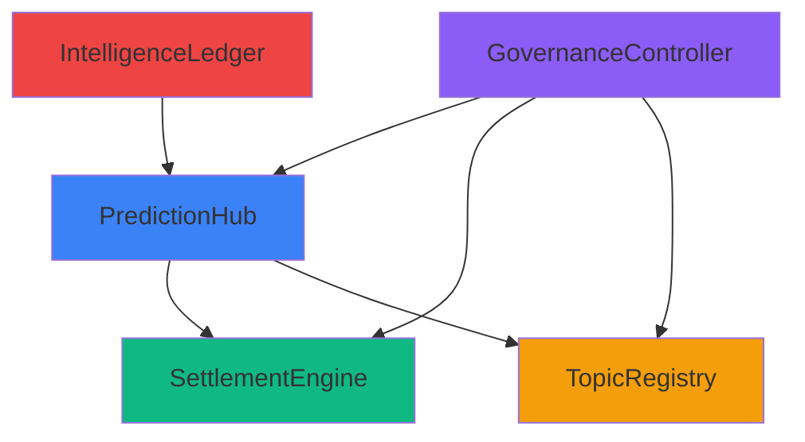

# Smart Contracts

Solidity smart contract documentation for the Privora protocol.

---

## 📋 Table of Contents

1. [Overview](#-overview)
2. [Contract Architecture](#-contract-architecture)
3. [Core Contracts](#-core-contracts)
4. [Interfaces](#-interfaces)
5. [Deployment](#-deployment)
6. [Security](#-security)

---

## 🌟 Overview

Privora's smart contracts implement:
- **PredictionHub**: Main market creation and management
- **SettlementEngine**: Payout calculation and distribution
- **TopicRegistry**: Category and metadata management
- **GovernanceController**: Admin functions and upgrades

Built on **Zama FHEVM** for encrypted operations.

---

## 🏗️ Contract Architecture



### Contract Dependencies

```
PredictionHub
├── SettlementEngine (payouts)
├── TopicRegistry (categories)
└── IntelligenceLedger (history)

GovernanceController
├── Ownable (admin)
└── UUPSUpgradeable (proxy)
```

---

## 📜 Core Contracts

### PredictionHub.sol

Main contract for prediction market management.

```solidity
contract PredictionHub is 
    Initializable, 
    UUPSUpgradeable, 
    AccessControl 
{
    // State
    mapping(uint256 => Prediction) public predictions;
    mapping(uint256 => mapping(address => UserPosition)) public positions;
    uint256 public nextPredictionId;
    
    // Events
    event PredictionCreated(
        uint256 indexed predictionId,
        string title,
        uint256 endTime
    );
    
    event PositionPlaced(
        uint256 indexed predictionId,
        address indexed user,
        bytes32 commitment
    );
    
    // Core Functions
    function createPrediction(
        bytes32 topicId,
        string memory title,
        string memory description,
        bytes32[] memory options,
        uint8 predictionType,
        uint256 endTime,
        uint256 liquidity
    ) external onlyRole(ADMIN_ROLE) returns (uint256);
    
    function placePosition(
        uint256 predictionId,
        uint256 optionIndex,
        bytes memory encryptedAmount
    ) external payable;
    
    function resolvePrediction(
        uint256 predictionId,
        uint256 winningOption
    ) external onlyRole(ADMIN_ROLE);
}
```

### SettlementEngine.sol

Handles payout calculations and distributions.

```solidity
contract SettlementEngine is Initializable, UUPSUpgradeable {
    // Parimutuel calculation
    function calculatePayout(
        uint256 predictionId,
        uint256 optionIndex
    ) public view returns (uint256) {
        uint256 totalPool = getTotalPool(predictionId);
        uint256 optionPool = getOptionPool(predictionId, optionIndex);
        return (totalPool * 1000) / optionPool; // 1000 = 1x base
    }
    
    function claimPayout(
        uint256 predictionId,
        bytes memory proof
    ) external;
}
```

### TopicRegistry.sol

Manages categories and metadata.

```solidity
contract TopicRegistry is Initializable, UUPSUpgradeable {
    struct Topic {
        bytes32 id;
        string name;
        string description;
        uint256 createdAt;
    }
    
    mapping(bytes32 => Topic) public topics;
    bytes32[] public topicList;
    
    function createTopic(
        string memory name,
        string memory description
    ) external onlyRole(ADMIN_ROLE) returns (bytes32);
}
```

### GovernanceController.sol

Admin and upgrade management.

```solidity
contract GovernanceController is 
    Initializable, 
    UUPSUpgradeable, 
    AccessControl 
{
    function pause() external onlyRole(ADMIN_ROLE);
    function unpause() external onlyRole(ADMIN_ROLE);
    function updateFee(uint256 newFee) external onlyRole(ADMIN_ROLE);
}
```

### IntelligenceLedger.sol

Records all prediction history.

```solidity
contract IntelligenceLedger is Initializable {
    struct Record {
        uint256 predictionId;
        address creator;
        uint256 timestamp;
        bytes32 hash;
    }
    
    mapping(uint256 => Record) public records;
}
```

---

## 🔌 Interfaces

### IPredictionHub.sol

```solidity
interface IPredictionHub {
    struct Prediction {
        uint256 id;
        bytes32 topicId;
        string title;
        string description;
        bytes32[] options;
        uint8 predictionType;
        uint256 endTime;
        uint256 liquidity;
        bool isResolved;
        uint256 winningOption;
    }
    
    function getPrediction(uint256 predictionId) external view returns (Prediction memory);
    function getUserPosition(uint256 predictionId, address user) external view returns (bytes memory);
}
```

### ISettlementEngine.sol

```solidity
interface ISettlementEngine {
    function calculatePayout(uint256 predictionId, uint256 optionIndex) external view returns (uint256);
    function getTotalPool(uint256 predictionId) external view returns (uint256);
}
```

---

## 🚀 Deployment

### Hardhat Deployment

```typescript
// scripts/deploy.ts
import { ethers, upgrades } from "hardhat";

async function main() {
  const PredictionHub = await ethers.getContractFactory("PredictionHub");
  const hub = await upgrades.deployProxy(PredictionHub, [], {
    initializer: false,
  });
  
  await hub.waitForDeployment();
  console.log("PredictionHub deployed to:", await hub.getAddress());
}

main().catch((error) => {
  console.error(error);
  process.exitCode = 1;
});
```

### Contract Addresses (Sepolia)

| Contract | Address |
|----------|---------|
| PredictionHub | `0x...` |
| SettlementEngine | `0x...` |
| TopicRegistry | `0x...` |
| GovernanceController | `0x...` |

### Verification

```bash
npx hardhat verify --network sepolia <contract-address>
```

---

## 🔒 Security

### Audit Checklist

- [ ] Reentrancy protection
- [ ] Integer overflow/underflow
- [ ] Access control verification
- [ ] FHE input validation
- [ ] Upgrade security

### Best Practices

```solidity
// Use Checks-Effects-Interactions
function placePosition(...) external {
    // Checks
    require(isActive, "Prediction not active");
    
    // Effects
    positions[predictionId][msg.sender] = position;
    
    // Interactions
    emit PositionPlaced(...);
}
```

### Upgrade Pattern

```solidity
// UUPS proxy pattern
function _authorizeUpgrade(address newImplementation) 
    internal 
    override 
    onlyRole(ADMIN_ROLE) 
{}
```

---

## 📚 Summary

Smart contract architecture:
- **PredictionHub**: Core market logic
- **SettlementEngine**: Payout calculations
- **TopicRegistry**: Category management
- **GovernanceController**: Admin functions

For FHE integration details:
- **FHEVM Integration:** [FHEVM_INTEGRATION.md](FHEVM_INTEGRATION.md)
- **Technical Architecture:** [TECHNICAL_ARCHITECTURE.md](TECHNICAL_ARCHITECTURE.md)